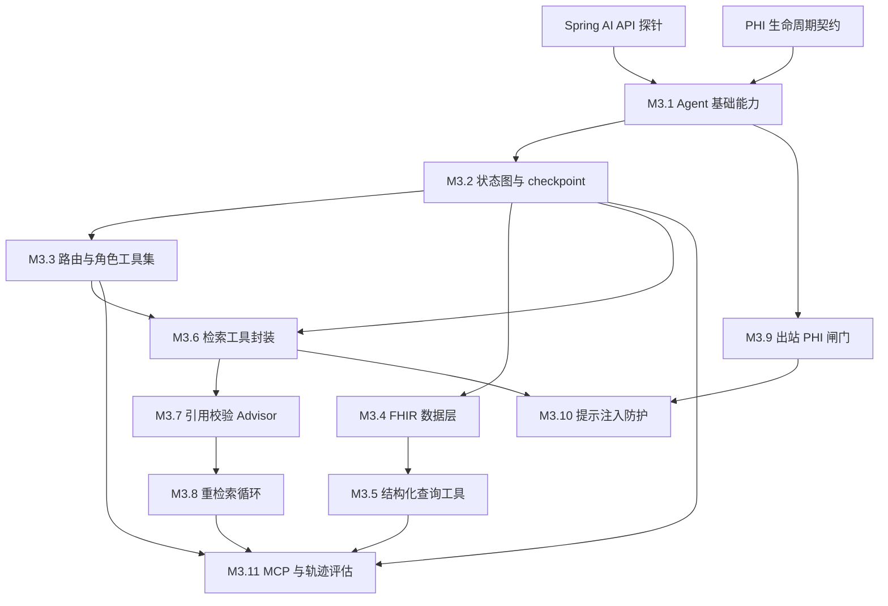

# M3 开发分析与任务拆解

日期：2026-08-10
范围：`REQUIREMENTS-FULL.md` 的 M3.1-M3.11 及 M3 阶段注意事项
状态：仅分析与规划，本轮不开发 M3 业务代码

## 1. 结论摘要

M3 的核心不是单独增加一个 Agent 服务，而是建立一条带安全边界的显式执行链：

```text
入口脱敏
  -> 显式状态图与 checkpoint
  -> 角色感知路由与工具集合
  -> 检索工具 / FHIR / 结构化查询
  -> 出站 PHI 闸门
  -> 生成
  -> 引用覆盖率校验
  -> 重检索或拒答
  -> 轨迹评估 / MCP 暴露
```

当前仓库已有 M0-M2 的检索、摄取、脱敏、引用存在性检查和评估基础，但以下能力仍不存在：

- `agent` 服务只有骨架，生成能力和旧引用校验仍在 `retrieval`。
- 没有 Agent 状态对象、显式图、checkpoint、恢复和轨迹投影。
- 没有角色到工具集的动态裁剪、分类路由和 OUT_OF_SCOPE 路径。
- 没有 `clinical-data` 的 FHIR 导入、结构化关系模型和聚合视图。
- 没有 SQL 白名单、只读数据库账号、k-anonymity 和结构化查询工具。
- 没有 Egress Guard、提示注入检测、MCP server 和 trajectory eval mode。

M3.9 是对外部署的合规阻塞项；完成前不得开放公网部署。

## 2. 前置决策

### M3-P01：确认 Spring AI API

Spring Boot `4.0.7` 与 Spring AI `2.0.0` 已在根 POM 和 ADR-002 中固定，但 Advisor、工具调用循环和 MCP API 不能按照旧版本示例猜测。

交付：

- 使用当前依赖编写最小编译探针，确认 `ChatClient`、Advisor、工具调用和 MCP 注解的实际包名与生命周期。
- 确认 Advisor 是否能观察工具循环内每一轮出站内容。
- 将 API 结论、依赖坐标和顺序语义回写 `docs/adr/ADR-002-spring-ai.md`。

验收：编译探针通过；不引入未锁定的旧版本 API；顺序语义有集成测试而不是只靠注册顺序。

### M3-P02：定义 PHI 生命周期与投影边界

在实现 AgentState 前先固定以下字段规则：

| 数据 | 请求内存 | 状态对象 | checkpoint / 审计 / 日志 / 缓存 |
|---|---|---|---|
| 原始查询 | 仅入口边界短暂存在 | 禁止 | 禁止 |
| 脱敏查询 | 允许 | 允许 | 只允许脱敏版本 |
| 原文哈希 | 允许 | 允许 | 允许，用于关联和去重 |
| 已准入 chunk 文本 | 允许生成使用 | 运行时允许 | 持久化投影禁止复制全文 |
| chunk ID、source range、版本、分数 | 允许 | 允许 | 允许 |

必须同时确定哈希算法、规范化规则、缓存键组成、checkpoint 保留期和恢复时的授权重检查。

## 3. 依赖图与阶段顺序



建议顺序：先完成 P01/P02，随后 M3.1、M3.2；M3.3 与 M3.4 可并行；M3.5 依赖 M3.4；M3.6 依赖 M3.2/M3.3；M3.7→M3.8 串行；M3.9 必须在任何外部 LLM 调用前完成；M3.10 依赖 M3.6/M3.9；M3.11 最后收口。

## 4. 细粒度任务拆解

每个任务均应由单个短周期实现单元完成，并由主代理审查跨模块契约和安全语义。

### M3.1 Agent 基础能力

| ID | 任务 | 主要范围 | 验收重点 | 依赖 |
|---|---|---|---|---|
| M3.1-A | 迁移生成边界 | 将 `retrieval` 的 generation、prompt、Answer DTO、旧引用存在性检查迁入 `agent`；决定 `/api/answer` 兼容策略 | `retrieval` 无 LLM provider 依赖；dev split 结果波动小于 2pp | P01 |
| M3.1-B | Agent 入口脱敏 | 新增 deid gRPC 客户端；入口第一步执行 `Anonymize`；生成脱敏查询、归一化查询和 query hash | PHI 查询在状态、日志、缓存和审计中只有脱敏值与 hash；deid 失败 fail-closed | P02 |
| M3.1-C | 最小 LLM 网关 | 以 `ChatClient` 建立 provider-neutral 入口，支持 provider/model、超时、token 和成本元数据 | 未配置或调用失败不会静默放行；所有调用有模型身份和用量记录 | P01, M3.1-A |
| M3.1-D | Advisor 与 ChatMemory 骨架 | 建立 Advisor 链、历史长度限制和多轮消息边界 | 历史消息也经过后续 Egress Guard；历史裁剪有配置和测试 | M3.1-C |
| M3.1-E | Advisor 顺序契约 | 固定 Egress Guard 在工具循环内侧、引用校验在循环外侧 | 多轮工具调用每轮触发出站检查，最终答案只做最终引用校验 | M3.1-D |

### M3.2 状态图与 checkpoint

| ID | 任务 | 主要范围 | 验收重点 | 依赖 |
|---|---|---|---|---|
| M3.2-A | 图技术选型 | 在 LangGraph4j 与类型化状态机之间比较兼容性、checkpoint、导出和维护成本 | ADR 能表达 route→tool→generate→verify→retry/respond/abstain | P01 |
| M3.2-B | AgentState 与持久化投影 | 定义 traceId、脱敏 query、queryHash、角色/工具集、分类、累积 chunks、轨迹、toolCalls、draft、citation、retry、termination | 原始 query 不进入状态；checkpoint 只保留候选 ID、区间、哈希、分数、排名和决策 | P02, M3.1-B |
| M3.2-C | 节点与硬终止 | 实现显式节点、最大执行次数、全局超时、terminationReason | 人为构造循环时必定终止；每轮可恢复 | M3.2-A/B |
| M3.2-D | checkpoint 存储与恢复 | 实现每节点快照、恢复适配器、授权重装载文本 | 中断后恢复；恢复时重新检查撤回版本、content domain 和角色可见性 | M3.2-B/C |
| M3.2-E | 轨迹与图导出 | 记录节点进入/退出、耗时、状态变更，生成 Mermaid/DOT | 导出节点/边与代码一致；轨迹不复制候选全文 | M3.2-C/D |

### M3.3 路由与角色工具集

| ID | 任务 | 主要范围 | 验收重点 | 依赖 |
|---|---|---|---|---|
| M3.3-A | 查询分类器 | 五类分类和置信度：政策、临床、结构化聚合、混合、越界 | 低置信度必定为 MIXED；分类进入状态和审计 | M3.2 |
| M3.3-B | 动态角色工具集 | 配置 CLINICIAN、RESEARCHER、ADMIN 的工具映射，在请求开始构造 ChatClient 工具集 | 未授权工具根本不存在，不是调用后拒绝 | M3.2 |
| M3.3-C | 越界拒答和观测 | OUT_OF_SCOPE 直接拒答，不调用检索或生成；记录角色、分类、置信度、工具集 | 不消耗 LLM 生成配额；日志不含原文 | M3.3-A/B |

### M3.4 FHIR 数据支线

| ID | 任务 | 主要范围 | 验收重点 | 依赖 |
|---|---|---|---|---|
| M3.4-A | HAPI FHIR 探针与 profile 校验 | 接入 HAPI FHIR R4，解析 Bundle 并校验 profile | 非法资源进入隔离表并有可读原因；不能只验证可解析 | M0.9 |
| M3.4-B | 导入 Job 与关系模型 | Spring Batch 导入 patient、encounter、condition、medication、observation | 1000 患者成功率至少 98%；失败资源不阻塞整批；幂等 | M3.4-A |
| M3.4-C | Safe Harbor 映射 | 只存出生年份、ZIP3，年龄大于 89 归并为 `90+`，保留编码值 | 不存在完整生日/ZIP；SNOMED、RxNorm、LOINC 原值保留 | M3.4-B |
| M3.4-D | 研究聚合视图 | 预建只含聚合结果的 RESEARCHER 视图 | 视图不返回个体记录；敏感度标签留给 M4 清单 | M3.4-C |

### M3.5 结构化查询工具

| ID | 任务 | 主要范围 | 验收重点 | 依赖 |
|---|---|---|---|---|
| M3.5-A | 数据库权限与视图白名单 | 独立只读账号，仅授予预定义视图权限；配置语句超时和行数上限 | DDL/DML/DELETE、基表访问均失败 | M3.4-D |
| M3.5-B | SQL 安全校验器 | 解析 SQL，限制单条 SELECT、白名单视图、LIMIT、危险函数和子查询绕过 | 至少 10 条注入/绕过全部阻断；校验失败不重试生成 | M3.5-A |
| M3.5-C | k-anonymity 与结果格式 | 研究角色执行最小组大小抑制，临床角色豁免需审计；结构化列说明和截断 | 默认阈值 5 可配置；审计不含返回数据 | M3.5-B |

### M3.6 检索工具

| ID | 任务 | 主要范围 | 验收重点 | 依赖 |
|---|---|---|---|---|
| M3.6-A | `policy_search` / `clinical_search` | 复用 M2 retrieval；固定 doc_type 过滤；不暴露 includeSuperseded | 两工具结果域严格分离，保留版本、生效日期和 stale | M3.2, M3.3 |
| M3.6-B | 调用配额与累积 | 限制单工具调用次数、topK、总 chunk 数；按 chunk ID 去重并标记来源工具 | 超限返回明确错误；状态累积有上限 | M3.6-A |
| M3.6-C | MIXED 并行编排 | `CompletableFuture` 并行两个工具，组合超时、快速取消和部分失败降级 | 实测接近慢分支耗时；双失败拒答；峰值最多四个数据库查询 | M3.6-A/B |
| M3.6-D | 上下文传播回归 | 工具线程传播角色、trace 和授权上下文，并在任务结束清理 | 不出现上一请求角色残留；与 M4.12 预留回归测试 | M3.6-C |

### M3.7 引用校验

| ID | 任务 | 主要范围 | 验收重点 | 依赖 |
|---|---|---|---|---|
| M3.7-A | 原始文本 span 对齐 | 由严格存在性升级为规范化空白/大小写/标点及有限编辑距离匹配 | 不存在 chunkId、伪造 quotedSpan 被拦截；绝不匹配 context prefix | M3.6 |
| M3.7-B | 论断覆盖率 | 文档化句子或子句拆分规则，计算有效引用支撑占比 | 默认阈值约 0.8 可配置；指标可复现 | M3.7-A |
| M3.7-C | 引用 Advisor 与时效性 | Advisor 放在工具循环外侧；区分证据不足、引用无效、越界和过期证据 | 无有效引用直接拒答；仅 SUPERSEDED 证据显式标注 | M3.7-B |

### M3.8 重检索循环

| ID | 任务 | 主要范围 | 验收重点 | 依赖 |
|---|---|---|---|---|
| M3.8-A | 重试策略 ADR | 选择扩大 topK、放宽过滤、查询改写或切换工具的组合 | 每轮必须有可验证的行为变化，不能同参数重试 | M3.7 |
| M3.8-B | 循环与 checkpoint | 召回累积，重试前后保存快照，默认最多 2 次，支持退避和收敛判断 | 召回集合不变、超时或次数耗尽时终止；不存在无限循环 | M3.8-A |
| M3.8-C | 用户提示与成本指标 | 前端显示“正在查找更多证据”，暴露 retry rate 和最终拒答原因 | 重试期间不出现空白等待；重试率可观测 | M3.8-B |

### M3.9 出站 PHI 闸门

| ID | 任务 | 主要范围 | 验收重点 | 依赖 |
|---|---|---|---|---|
| M3.9-A | 单一收口与来源策略 | 固定 Advisor 内侧位置，并在 LLM gateway 设置兜底；定义 `(entity, source, destination)` 策略 | 所有 LLM 路径都经过收口；本地/外部目的地行为明确 | M3.1, M3.2 |
| M3.9-B | 按来源分治检测 | 系统提示启动检查；用户查询复用入口脱敏；chunk 查 `phi_scan_status`；工具输出三档检测；历史复用脱敏结果 | chunk 不重复调用 NER；工具输出单独覆盖 | M3.9-A |
| M3.9-C | fail-closed 与审计 | 检测器异常、超时、不可用均阻断；审计只写实体类型、动作、payload hash、目的地 | 不存在宽松 fallback；审计无 PHI 原文 | M3.9-B |
| M3.9-D | 性能、canary 与红队 | 建立泄漏 canary、P95 分解和包含姓名变体/编码形式的红队集 | Egress P95 < 50ms；拦截率有基线；README 限制只在完成后移除 | M3.9-C |

### M3.10 提示注入防护

| ID | 任务 | 主要范围 | 验收重点 | 依赖 |
|---|---|---|---|---|
| M3.10-A | 数据边界格式 | 用结构化消息或不可预测边界包裹召回内容和工具输出，系统提示声明其为数据 | 文档不能伪造边界；引用文本仍以原始 chunk 为准 | M3.6, M3.9 |
| M3.10-B | 注入启发式检测 | 扫描指令劫持、角色扮演、系统提示泄漏、工具滥用、引用伪造、编码变形 | 命中只标记和审计，不默认删除 | M3.10-A |
| M3.10-C | 真实召回红队 | 至少 30 条注入文本进入测试文档并走完整摄取→检索→Agent 路径 | 防护率和未防住样本如实归档到报告/README | M3.10-B |

### M3.11 MCP 与轨迹评估

| ID | 任务 | 主要范围 | 验收重点 | 依赖 |
|---|---|---|---|---|
| M3.11-A | MCP 最小暴露 | 暴露 policy_search、clinical_search；structured_query 默认关闭；先采用简单令牌和限流 | 客户端可发现/调用；角色裁剪仍生效；调用来源审计 | M3.3, M3.6 |
| M3.11-B | trajectory eval mode | 评估集增加 `expected_tools[]`、`expected_behavior`；读取 checkpoint 生成六项轨迹指标 | 失败样本含 trace_id、阶段、排名变化、降级码，不复制全文 | M3.2, M3.3, M3.6, M3.8 |
| M3.11-C | CI 与 holdout-v3 | 越权工具访问纳入 PR 零容忍门禁，其余指标纳入夜间；一次性消费 holdout-v3 | 报告记录评估集版本、commit、模型版本和复用偏差 | M3.11-B, M2.8 |

## 5. 当前 M0-M2 进入 M3 前的处理边界

### 已在本轮处理的确定性实现问题

- F-09：Spring Batch 元数据纳入 `V5__spring_batch_metadata.sql`，应用配置改为 `initialize-schema: never`，上下文测试不再启用启动时初始化；干净 PostgreSQL 与重启持久化证据仍待补齐。
- F-01：已新增 retrieval 镜像并接入 Compose `pipeline`/`full` profile；完整 agent/answer 链路、模型资产和 Docker 实跑证据仍待补齐。
- F-07：已新增显式 `m1-baseline` profile，选择 `VECTOR_ONLY`，默认 M2 `HYBRID` 保持不变；真实基线测量仍待补齐。
- F-12：缓存管理控制器默认不装配；显式启用时的内部管理面或认证边界仍待补齐。

### 必须记录、暂不伪造结果的问题

- F-03：完整 Testcontainers 链路和三次稳定运行需要 Docker、sidecar 和安全 fixture。
- F-04：许可的 300 条评估集、脱敏标注和 holdout-v2/v3 资产不在仓库。
- F-05：生产 embedding/reranker、de-identification NLP 模型、HMAC salt 和 LLM provider 尚未配置。
- F-06：API embedding 后端需要先确定 provider、超时、成本和 PHI 出站策略。
- F-08：M2 质量、延迟、内存、成本实验仍为 `NOT MEASURED`。
- F-10：数据获取依赖逐来源许可、凭据和 normalization 方案，当前 fail-closed 脚本行为不能改成假成功。

## 6. M3 开发前的硬性闸门

M3 进入实现前必须满足：

1. P01 API 探针通过，Advisor/MCP 依赖与生命周期已写入 ADR-002。
2. P02 PHI 字段白名单、query hash、checkpoint 投影和保留期已评审。
3. F-09 的干净 PostgreSQL migration 和 Batch restart 证据已补齐。
4. F-01 Compose 至少能启动 retrieval 容器；完整回答链路仍需 agent、模型和 Docker 证据。
5. M1 vector-only baseline profile 与 M2 HYBRID 默认路径可明确区分，并完成真实基线测量。
6. 不将真实语料、模型权重、密钥或未测量实验结果提交到仓库。

## 7. M3 最终验收清单

- `retrieval` 不再含 LLM provider 依赖，生成能力归属 `agent`。
- Advisor 顺序有代码注释、ADR 和多轮工具调用测试。
- 原始查询不进入 AgentState、checkpoint、审计、日志和缓存。
- 入口脱敏与 Egress Guard 均 fail-closed。
- checkpoint 不含 PHI，也不复制候选全文；恢复会重新执行授权与版本检查。
- 未授权工具从工具集合中消失，而不是调用后返回拒绝。
- 结构化查询具备只读账号、视图白名单、SQL 解析、LIMIT/超时、k-anonymity 和审计。
- MIXED 并行工具调用不会造成角色串用或线程上下文残留。
- structured_query 默认不通过 MCP 暴露。
- M3.9 完成前禁止公网部署。
- holdout-v3 按滚动 holdout 纪律执行并归档。
